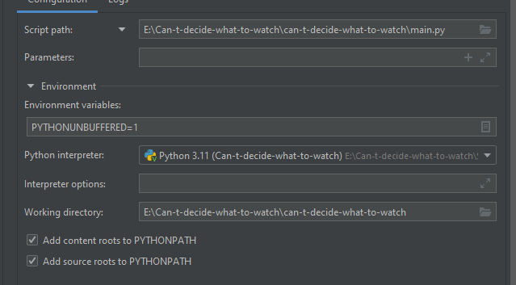

# Can-t-decide-what-to-watch
Regułowy system ekspercki do podejmowania decyzji na temat tego, co użytkownik powinien obejrzeć.

Używany język: Python + CLIPS


## Project setup
### Powershell / Windows

1. In project directory
```
python -m venv .
```
2. Activate virtual environment
```
./Scripts/activate
```

3. Install requirements
```
pip install -r requirements.txt
```

4. Run
```
python can-t-decide-what-to-watch/main.py
```

### Linux

1. In project directory
```
python -m venv .
```
2. Activate virtual environment
```
source bin/activate
```

3. Install requirements
```
pip install -r requirements.txt
```

4. Run
```
python can-t-decide-what-to-watch/main.py
```

## Pycharm setup
1. In edit configurations choose python interpreter with virtual env ```(Can-t-decide-what-to-watch)```
2. Script path: ```main.py```




